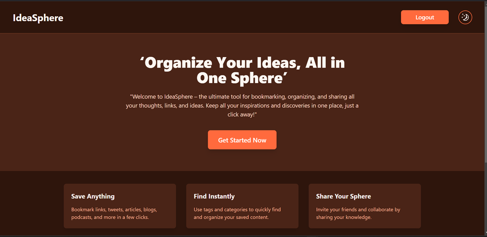
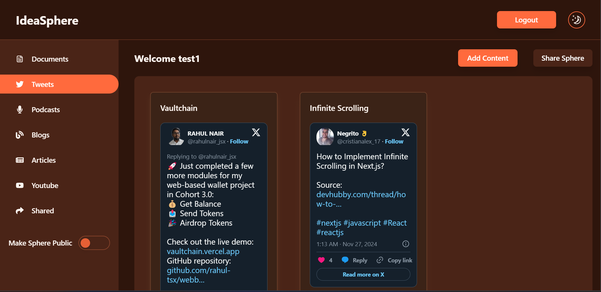

# IdeaSphere

IdeaSphere is a MERN stack application designed to help you organize, store, and share your ideas seamlessly. With a clean and responsive interface, you can save, categorize, and instantly find your ideas whenever you need them. It also allows you to share your knowledge with others in a collaborative space.

This is the **Frontend** part of the application built with **ReactJs**, **TypeScript**, and **Tailwind CSS**. It connects to a separate backend created with **Node.js**, **Express**, and **MongoDB**.

---

## Features

- **User Authentication**: Log in to your account and access your personal sphere of ideas.
- **Save Anything**: Bookmark articles, links, tweets, blogs, and more with just a few clicks.
- **Organize Ideas**: Use tags and categories to quickly find and organize your saved content.
- **Share Your Ideas**: Collaborate with friends or share your knowledge with others.
- **Responsive Design**: Works seamlessly on desktop and mobile devices.

---

### Technologies Used

- **Frontend**:

  - ReactJS
  - TypeScript
  - Tailwind CSS
  - Zustand (for state management)
  - Zod (for form validation)
  - Axios (for API requests)
  - Framer Motion (for animations)
  - React Router (for routing)

- **Backend**:
  - Node.js
  - Express
  - MongoDB

---

## Live Site

You can explore the live version of **IdeaSphere** by visiting the following link:

[**IdeaSphere - Live Site**](https://ideasphere-fawn.vercel.app/)

## Test Credentials

To test the **IdeaSphere** application, you can use the following test credentials:

### Login with Test User

- **Username**: `test1@gmail.com`
- **Password**: `123456`
- **Username**: `test2@gmail.com`
- **Password**: `123456`

These credentials provide access to the app's features. You can explore the functionality by logging in with this test account and interacting with the platform as a normal user.

---

## Features in Progress & Future Plans

- AI Integration: Future integration of an AI-powered chatbot using a vector database to help users query their ideas within the sphere.
- Enhanced Search: Advanced search capabilities for easier idea discovery.
- Collaborative Features: Improve sharing and collaboration with more granular access control.
